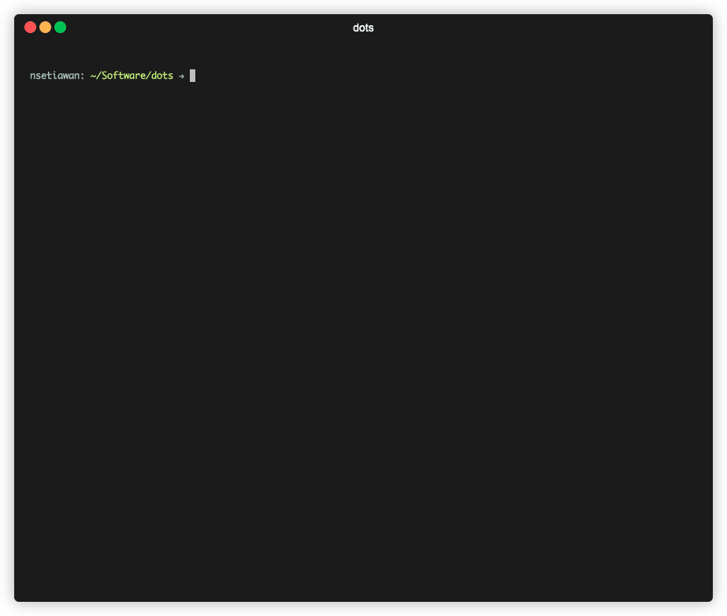

# Dotfiles Repo and Environment Setup Script

dots is repository for storing my dotfiles with environment auto installation script inspired by [atomantic](https://github.com/atomantic/dotfiles). Installation script works for:
- MacOS in a local machine. Installing full version of environment
- Ubuntu in a remote machine. Installing lite version of environment

## Usage

Run the install script to setup environment

```
./install.sh
```


